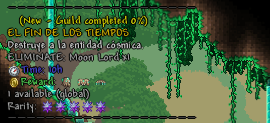
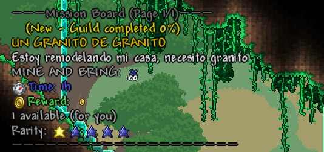
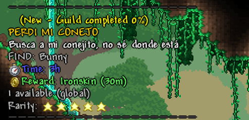
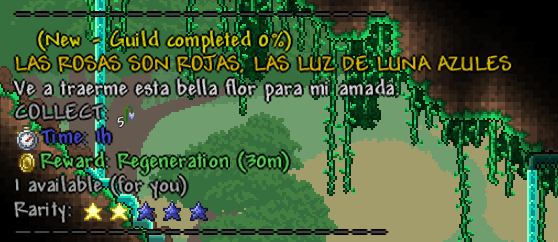

# Guía de Creación de Misiones en DynamicMissionsEz

Esta guía explica cómo configurar el archivo `missionslist.json` para añadir contenido personalizado a tu servidor de Terraria.

También puedes usar las misiones creadas por mí en el siguiente archivo:
[Misiones](missionslist.json)

---

## 1. Estructura Básica (Plantilla)
Cada misión es un objeto dentro de una lista `[]`. Recuerda separar cada objeto con una coma `,` (excepto la última misión de la lista).

```json
{
  "MissionName": "NOMBRE DE LA MISIÓN",
  "MissionDescription": "Descripción que verá el jugador.",
  "TypeMission": "kill",
  "TypeReward": "item",
  "MissionObj": "ID_O_NOMBRE:CANTIDAD",
  "TargetTileId": "-1",
  "Reward": "RECOMPENSA",
  "Rarity": 50,
  "Time": "1h",
  "Quant": 1,
  "GlobalQuant": false,
  "RemoveItem": false,
  "OnlyHardMode": false,
  "OnlyPreHardMode": false
}
```

---

## 2. Tipos de Misión (`TypeMission`)
Determina qué debe hacer el jugador para progresar:

| Tipo | Acción | Requisito en `TargetTileId` |
| :--- | :--- | :--- |
| `kill` | Matar enemigos o jefes. | Debe ser `"-1"` (ninguno). |
| `mine` | Picar bloques (aparece como "PICA Y TRAE"). | ID y SubID del bloque a picar. |
| `collect` | Picar plantas o bloques (aparece como "RECOLECTA"). | ID y SubID del bloque/planta. |
| `find` | Buscar un NPC especial en el mundo. | Debe ser `"-1"` (ninguno). |

---

## 3. Tipos de Recompensa (`TypeReward`) y Formatos
Puedes poner **múltiples recompensas** separándolas con comas (`,`).

###  Dinero (`money`)
Usa letras para definir el valor: `p` (platino), `g` (oro), `s` (plata), `c` (cobre).
* *Ejemplo simple:* `"5g"`
* *Ejemplo múltiple:* `"1g, 50s"`

###  Objetos (`item`)
Usa el formato `ID:CANTIDAD`.
* *Ejemplo simple:* `"3093:1"` (Poción)
* *Ejemplo múltiple:* `"1736:1, 1737:1, 1738:1"` (Set de objetos)

Lista de ItemID:
https://terraria.wiki.gg/wiki/Item_IDs

###  Buffs (`buff`)
Usa el formato `ID:TIEMPO`. El tiempo puede ser `m` (minutos) o `h` (horas).
* *Ejemplo simple:* `"5:10m"` (Regeneración por 10 min)
* *Ejemplo múltiple:* `"2:15m, 11:15m"` (Varios efectos)

Lista de Buff ID:
https://terraria.wiki.gg/wiki/Buff_IDs

---

## 4. El Sistema de Raridad (`Rarity`)
El valor va de **1 a 100**. Determina la probabilidad de aparición y el icono visual en el tablero:

* ★☆☆☆☆ **1 - 19**: 1 Estrella (Muy común)
* ★★☆☆☆ **20 - 39**: 2 Estrellas
* ★★★☆☆ **40 - 64**: 3 Estrellas
* ★★★★☆ **65 - 84**: 4 Estrellas
* ★★★★★ **85 - 94**: 5 Estrellas
* ✮✮✮✮✮ **95 - 100**: 5 Cristales Arcanos  - **Raridad Mítica**

---

## 5. Filtros de Progresión de Mundo
Controla cuándo aparecen las misiones según el estado del servidor:

* `"OnlyHardMode": true`: La misión solo aparece tras derrotar a la Muralla de Carne.
* `"OnlyPreHardMode": true`: La misión deja de aparecer para siempre una vez se entra al Hardmode.
* Ambos en `false`: La misión aparece en cualquier etapa del juego, desde el inicio hasta el final.

---

## 6. Otras Variables Importantes
* **`MissionObj`**:
    * Para `kill/mine/collect`: Usa `ID:CANTIDAD` o `Nombre:CANTIDAD`. Ej: `"esqueleto:10"` o `"173:5"`.
    * Para `find`: Usa solo el ID del NPC. Ej: `"656"`.
      
Enlace a la lista de mobs y NPC:
https://terraria.wiki.gg/wiki/NPC_IDs

* **`TargetTileId`**: Crucial para evitar trampas en misiones de minería. Indica qué bloque es válido romper. Soporta Sub IDs (ej: `"84:1"` para Luz de Luna) y múltiples IDs (ej: `"84:1, 83:1"` En este caso las dos versiones de luz de luna crecidas, ID 84 Sub-ID 1 e ID 83 Sub-ID 1, para asegurarnos de que funcione).

Lista de tile ID y Sub-ID:
https://terraria.wiki.gg/wiki/Tile_IDs

* **`Quant`**: Cuántas veces se puede completar una misión antes de agotarse.
* **`GlobalQuant`**: Si es `true`, el primero que la haga la agota para todo el servidor. Si es `false`, el límite de `Quant` es individual por cada jugador.
* **`RemoveItem`**: Si es `true`, el plugin le quitará los materiales recolectados al jugador cuando vaya a entregar la misión.

---

## 7. Ejemplos de Misión
###  🔪 Kill Mission
```json
{
  "MissionName": "EL FIN DE LOS TIEMPOS",                 (Nombre de la misión)
  "MissionDescription": "Destruye a la entidad cósmica.", (descripción de la misión)
  "TypeMission": "kill",                                  (hay que matar a un objetivo)
  "TypeReward": "item",                                   (La recompensa es un objeto)
  "MissionObj": "Moon Lord:1",                            (El objetivo de la misión, en este caso 1 Moon Lord)
  "TargetTileId": "-1",                                   (Tile a golpear, innecesario en este caso, pues es matar, se deja en -1)
  "Reward": "3373:1, 5515:1, 5001:1",                     (Id de items para recompensa, en este caso uno de cada parte del set de moonlord)
  "Rarity": 99,                                           (Rareza, en este caso mítica, 99/100)
  "Time": "10h",                                          (Tiempo disponible para cumplir la misión una vez tomada, 10 horas en este caso)
  "Quant": 1,                                             (Cantidad de veces que puede tomarse esa misión, en este caso 1 vez)
  "GlobalQuant": true,                                    (La cantidad de veces que se puede tomar la misión es global? en este caso TRUE significa que solo se puede tomar 1 vez en general y no 1 vez por jugador)
  "RemoveItem": false,                                    (determkina si te quitan el MissionObj al completar la misión, como es una misión de Kill, entonces es irrelevante)
  "OnlyHardMode": true,                                   (La misión solo aparecerá en el Hard-Mode porque está en True)
  "OnlyPreHardMode": false                                (La misión no aparecerá en el Pre-Hardmode porque está en False)
}
````



---

### ⛏️ Mine Mission
```json
  {
    "MissionName": "UN GRANITO DE GRANITO",
    "MissionDescription": "Estoy remodelando mi casa, necesito granito",
    "TypeMission": "mine",                                (hay que minar un objetivo)
    "TypeReward": "money",                                (La recompensa es dinero)
    "MissionObj": "3086:100",                             (El objetivo son 100 bloques de granito -Item ID 3086-)
    "TargetTileId": "368",                                (El id del Tile -Bloque colocado- que se deberá minar)
    "Reward": "1g",                                       (La recompensa es 1 de oro)
    "Rarity": 5,                                          (la rareza es 5, muy común, 5/100)
    "Time": "1h",                                         (Tienes 1 hora para completar la misión una vez tomada)
    "Quant": 1,                                           (La misión se puede tomar solo 1 vez cuando aparece)
    "GlobalQuant": false,                                 (La cantidad de veces que se puede tomar es individual, es 1 por jugador)
    "RemoveItem": true,                                   (Al entregar la misión se te quitarán los 100 de granito)
    "OnlyHardMode": false,                                (No es solo del Hard-Mode)
    "OnlyPreHardMode": false                              (No es solo del Pre-Hardmode)
  }
```


---
### 🐇 Find Mission
```json
  {
    "MissionName": "PERDI MI CONEJO",
    "MissionDescription": "Busca a mi conejito, no sé donde está",
    "TypeMission": "find",                                (Hay que encontrar a un NPC)
    "TypeReward": "buff",                                 (Se te dará un Buff como recompensa)
    "MissionObj": "656",                                  (El objetivo es un conejito de ciudad, NPC ID 656)
    "TargetTileId": "-1",                                 (Tile a golpear, innecesario en este caso, pues es encontrar, se deja en -1)
    "Reward": "5:30m",                                    (La recompensa es el Buff Piel de hierro -ID 5- durante 30 minutos)
    "Rarity": 94,                                         (La rareza es de 94, muy rara, 94/100)
    "Time": "3h",                                         (tiempo para completar la misión)
    "Quant": 1,                                           (1 sola disponible)
    "GlobalQuant": true,                                  (La disponibilidad es global, no individual, 1 para todo el server)
    "RemoveItem": false,                                  (No se te quita el Item al entregar la misión, pues no hay item)
    "OnlyHardMode": false,
	"OnlyPreHardMode": false
  }
```


---

### 💐 Collect Mission
```json
  {
    "MissionName": "LAS ROSAS SON ROJAS, LAS LUZ DE LUNA AZULES",
    "MissionDescription": "Ve a traerme esta bella flor para mi amada.",
    "TypeMission": "collect",                             (Hay que recolectar un objeto)
    "TypeReward": "buff",                                 (La recompensa es un Buff)
    "MissionObj": "314:5",                                (Deberás recolectar 5 luz de luna -ID 314-)
    "TargetTileId": "82:1, 83:2, 84:1",                   (Tiles a golpear para recolectar -ID 82 83 84:SubID 1- en este caso la luz de luna tiene 3 tiles y sub-tiles diferentes, por eso se ponen sus 3 variantes)
    "Reward": "2:30m",                                    (La recompensa es el Buff ID 2 -Regeneración- durante 30 minutos)
    "Rarity": 30,                                         (La Rareza es 30, mas o menos común, 30/100)
    "Time": "1h",                                         (Una hora para completar la misión)
    "Quant": 1,                                           (Una sola misión disponible para tomar)
    "GlobalQuant": false,                                 (Es una misión por jugador, no es cantidad global)
    "RemoveItem": true,                                   (Se te quitarán las Luz de luna al entregar la misión)
    "OnlyHardMode": false, 
    "OnlyPreHardMode": false
  }
```

