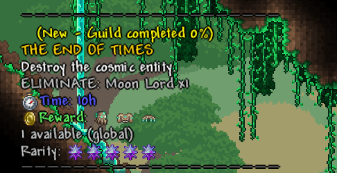
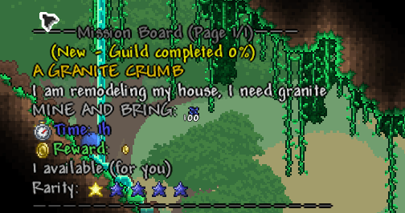
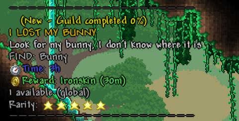
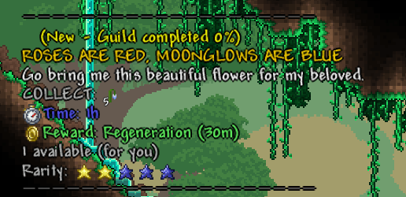

# Quest Creation Guide for DynamicMissionsEz

This guide explains how to configure the `missionslist.json` file to add custom content to your Terraria server.

You can also use the quests I created in the following file (Spanish, Translations and new quests are welcome!):
[Misiones](missionslist.json)

---

## 1. Basic Structure (Template)
Each quest is an object inside a list/array `[]`. Remember to separate each object with a comma `,` (except the last quest in the list).

```json
{
  "MissionName": "QUEST NAME",
  "MissionDescription": "Description visible to the player.",
  "TypeMission": "kill",
  "TypeReward": "item",
  "MissionObj": "ID_OR_NAME:AMOUNT",
  "TargetTileId": "-1",
  "Reward": "REWARD",
  "Rarity": 50,
  "Time": "1h",
  "Quant": 1,
  "GlobalQuant": false,
  "RemoveItem": false,
  "OnlyHardMode": false,
  "OnlyPreHardMode": false
}
```

---

## 2. Quest Types (`TypeMission`)
Determines the required action for player progression:

| Type | Action | Requirement for `TargetTileId` |
| :--- | :--- | :--- |
| `kill` | Kill enemies or bosses. | Must be `"-1"` (none). |
| `mine` | Mine blocks (displayed as "MINE AND BRING"). | ID and Sub-ID of the target block. |
| `collect` | Harvest plants or blocks (displayed as "COLLECT"). | ID and Sub-ID of the target block/plant. |
| `find` | Locate a special NPC in the world. | Must be `"-1"` (none). |

---

## 3. Reward Types (`TypeReward`) and Formats
You can configure **multiple rewards** separated by commas (`,`).

### 💰 Money (`money`)
Use letters to define coin values: `p` (platinum), `g` (gold), `s` (silver), `c` (copper).
* *Single reward:* `"5g"`
* *Multiple rewards:* `"1g, 50s"`

### 📦 Items (`item`)
Uses the `ID:AMOUNT` format.
* *Single reward:* `"3093:1"` (Potion)
* *Multiple rewards:* `"1736:1, 1737:1, 1738:1"` (Armor Set)

Item ID List:
https://terraria.wiki.gg/wiki/Item_IDs

### ✨ Buffs (`buff`)
Uses the `ID:DURATION` format. Duration accepts `m` (minutes) or `h` (hours).
* *Single reward:* `"5:10m"` (Ironskin for 10 min)
* *Multiple rewards:* `"2:15m, 11:15m"` (Multiple effects)

Buff ID List:
https://terraria.wiki.gg/wiki/Buff_IDs

---

## 4. Rarity System (`Rarity`)
The value ranges from **1 to 100**. It determines the roll chance and the visual icon on the quest board:

* ★☆☆☆☆ **1 - 19**: 1 Star (Common)
* ★★☆☆☆ **20 - 39**: 2 Stars
* ★★★☆☆ **40 - 64**: 3 Stars
* ★★★★☆ **65 - 84**: 4 Stars
* ★★★★★ **85 - 94**: 5 Stars
* ✮✮✮✮✮ **95 - 100**: 5 Arcane Crystals - **Mythic Rarity**

---

## 5. World Progression Filters
Controls when quests appear based on world state:

* `"OnlyHardMode": true`: Quest only appears after defeating the Wall of Flesh.
* `"OnlyPreHardMode": true`: Quest permanently stops appearing once the world enters Hardmode.
* Both set to `false`: Quest can appear at any progression stage.

---

## 6. Other Important Variables
* **`MissionObj`**:
  * For `kill/mine/collect`: Use `ID:AMOUNT` or `Name:AMOUNT` (e.g., `"skeleton:10"` or `"173:5"`).
  * For `find`: Use only the NPC ID (e.g., `"656"`).

NPC & Mob ID List:
https://terraria.wiki.gg/wiki/NPC_IDs

* **`TargetTileId`**: Essential anti-exploit check for mining/harvesting quests. Specifies valid blocks to break. Supports Sub-IDs (e.g., `"84:1"` for Moonglow) and multiple entries (e.g., `"84:1, 83:1"` to cover grown Moonglow variants).

Tile ID & Sub-ID List:
https://terraria.wiki.gg/wiki/Tile_IDs

* **`Quant`**: Number of completions available before the quest is exhausted.
* **`GlobalQuant`**: Set to `true` to make the stock server-wide (first-come, first-served), or `false` for individual player stock.
* **`RemoveItem`**: Set to `true` to consume the required quest items from the player's inventory upon turn-in.

---

## 7. Quest Examples

### 🔪 Kill Mission
```json
{
  "MissionName": "THE END OF TIMES",                      (Quest name)
  "MissionDescription": "Destroy the cosmic entity.",     (Quest description)
  "TypeMission": "kill",                                  (Objective is to kill a target)
  "TypeReward": "item",                                   (Reward is an item)
  "MissionObj": "Moon Lord:1",                            (Quest objective, in this case 1 Moon Lord)
  "TargetTileId": "-1",                                   (Tile to hit, unnecessary in this case since it's a kill quest, left as -1)
  "Reward": "3373:1, 5515:1, 5001:1",                     (Item IDs for the reward, in this case one of each piece of the Moon Lord set)
  "Rarity": 99,                                           (Rarity, in this case mythic, 99/100)
  "Time": "10h",                                          (Time available to complete the quest once accepted, 10 hours in this case)
  "Quant": 1,                                             (Number of times this quest can be taken, in this case 1 time)
  "GlobalQuant": true,                                    (Is the completion limit global? TRUE means only 1 completion overall across the server, not 1 per player)
  "RemoveItem": false,                                    (Determines if the MissionObj is consumed upon turn-in; irrelevant for kill quests)
  "OnlyHardMode": true,                                   (Quest will only appear in Hardmode because it is set to True)
  "OnlyPreHardMode": false                                (Quest will not appear in Pre-Hardmode because it is set to False)
}
````


---

### ⛏️ Mine Mission
```json
{
  "MissionName": "A GRANITE CRUMB",
  "MissionDescription": "I am remodeling my house, I need granite",
  "TypeMission": "mine",                                  (Objective is to mine a target)
  "TypeReward": "money",                                  (Reward is money)
  "MissionObj": "3086:100",                               (Objective is 100 granite blocks -Item ID 3086-)
  "TargetTileId": "368",                                  (Tile ID -placed block- that must be mined)
  "Reward": "1g",                                         (Reward is 1 gold)
  "Rarity": 5,                                            (Rarity is 5, very common, 5/100)
  "Time": "1h",                                           (You have 1 hour to complete the quest once accepted)
  "Quant": 1,                                             (The quest can only be taken 1 time when it appears)
  "GlobalQuant": false,                                   (Completion limit is individual, 1 per player)
  "RemoveItem": true,                                     (Upon delivering the quest, 100 granite will be removed from your inventory)
  "OnlyHardMode": false,                                  (Not exclusive to Hardmode)
  "OnlyPreHardMode": false                                (Not exclusive to Pre-Hardmode)
}
```


---
### 🐇 Find Mission
```json
{
  "MissionName": "I LOST MY BUNNY",
  "MissionDescription": "Look for my bunny, I don't know where it is",
  "TypeMission": "find",                                  (Objective is to find an NPC)
  "TypeReward": "buff",                                   (Reward is a buff)
  "MissionObj": "656",                                    (Objective is a Town Bunny, NPC ID 656)
  "TargetTileId": "-1",                                   (Tile to hit, unnecessary in this case since its a find quest, left as -1)
  "Reward": "5:30m",                                      (Reward is the Ironskin Buff -ID 5- for 30 minutes)
  "Rarity": 94,                                           (Rarity is 94, very rare, 94/100)
  "Time": "3h",                                           (Time to complete the quest)
  "Quant": 1,                                             (Only 1 available)
  "GlobalQuant": true,                                    (Availability is global across the entire server, not per player)
  "RemoveItem": false,                                    (No item is removed upon completion since there is no item)
  "OnlyHardMode": false,
  "OnlyPreHardMode": false
}
```


---

### 💐 Collect Mission
```json
{
  "MissionName": "ROSES ARE RED, MOONGLOWS ARE BLUE",
  "MissionDescription": "Go bring me this beautiful flower for my beloved.",
  "TypeMission": "collect",                               (Objective is to collect/harvest an item)
  "TypeReward": "buff",                                   (Reward is a buff)
  "MissionObj": "314:5",                                  (You must gather 5 Moonglow -Item ID 314-)
  "TargetTileId": "82:1, 83:2, 84:1",                     (Tiles to hit to collect -ID 82/83/84:SubID 1- covering all 3 tile/sub-tile variants of grown Moonglow)
  "Reward": "2:30m",                                      (Reward is Buff ID 2 -Regeneration- for 30 minutes)
  "Rarity": 30,                                           (Rarity is 30, fairly common, 30/100)
  "Time": "1h",                                           (One hour to complete the quest)
  "Quant": 1,                                             (Only one quest available to take)
  "GlobalQuant": false,                                   (One quest per player, not a global limit)
  "RemoveItem": true,                                     (Moonglows will be removed upon delivering the quest)
  "OnlyHardMode": false,
  "OnlyPreHardMode": false
}
```

